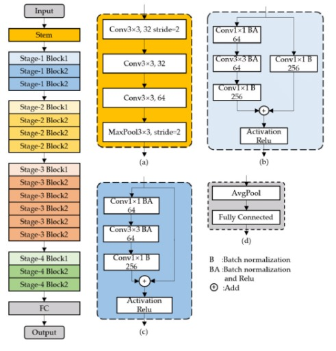
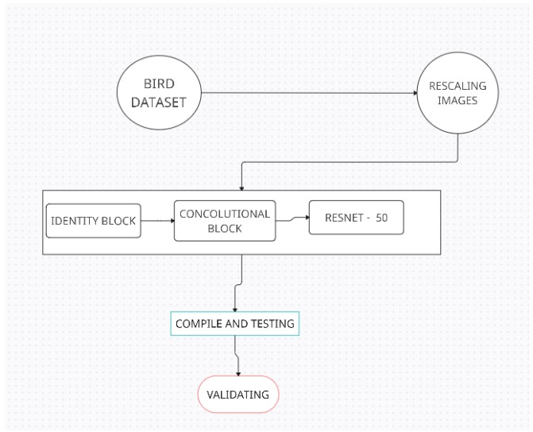
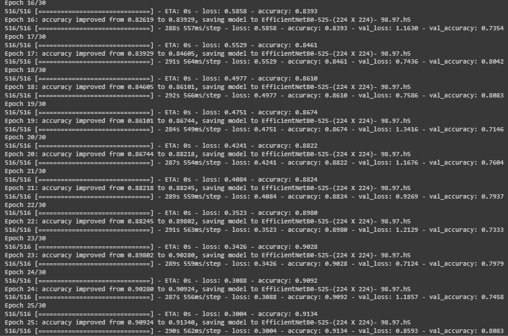
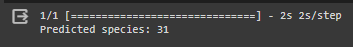

# Bird-Species-image-Classification-using-Convolution-Neural-Networks
This project utilizes Convolutional Neural Networks (CNNs) to classify bird species from images, employing deep learning techniques for feature extraction. The model is trained on a diverse dataset, achieving accurate species identification and demonstrating the effectiveness of CNNs in image classification tasks for ornithological research and conservation efforts.
# Features:

* Utilizes CNNs for accurate bird species identification.
* Trains on a diverse dataset for robust performance.
* Implements with ResNet-50 for effective feature extraction.
* Supports conservation efforts by automating species identification.
* Enables scalability, fine-tuning, and deployment for real-world applications.
# Requirements:
Python 3.x for project development.

Essential Python packages: tensorflow, keras, os, scipy for image processing.

# ResNet50 Architecture Diagram:

# Flow chart:


# About Dataset:

All images are 224 X 224 X 3 color images in jpg format. Data set includes a train set, test set and validation set. Each set contains 202 sub directories, one for each bird species.This is a very high quality dataset where there is only one bird in each image and the bird typically takes up at least 50% of the pixels in the image. As a result even a moderately complex model will achieve training and test accuracies in the mid 90% range.Images were gathered from internet searches by species name. Once the image files for a species was downloaded they were checked for the presemce of duplicate or near duplicate images. All duplicate or near duplicate images detected were deleted in order to prevent their being images common between the training, test and validation sets.
### Test Data:
```
https://drive.google.com/file/d/1gn1kflszgSvnGEGk5L7dfIUQ-KWygryQ/view?usp=drive_link
```

### Train Data:

```
https://drive.google.com/file/d/1fnDmsQY7wvgUke64jJxJiwPxXUrNsOn9/view?usp=drive_link
```
# Installation:
1. Clone the repository:
```
https://github.com/Manojkumar-Siva/Bird-Species-image-Classification-using-Convolution-Neural-Networks
```
2. Install the required packages:

3. Download the pre-trained bird species model and label mappings.
# Usage:
1. Open a new Google Colab notebook.

2. Upload the project files in Google Drive.

3. Load the pre-trained model and label mappings. Ensure the model files are correctly placed in the Colab working directory.

4. Execute the birdspecies_classification script in the Colab notebook, which may involve adapting the script to run within a notebook environment.


5. Follow the on-screen instructions or customize input cells in the notebook for bird species classification  with uploaded bird images.

6. View and analyze the results directly within the Colab notebook.

7. Repeat the process for additional images or iterations as needed.
# Program:
```py
from google.colab import drive
drive.mount('/content/gdrive')

!unzip gdrive/MyDrive/mini_project/training.zip
!unzip gdrive/MyDrive/mini_project/valid.zip

import tensorflow.keras.backend as K
from tensorflow.keras.models import Model, Sequential
from tensorflow.keras.layers import Input, Dense, Flatten, Dropout, BatchNormalization
from tensorflow.keras.layers import Conv2D, SeparableConv2D, MaxPool2D, LeakyReLU, Activation
from tensorflow.keras.applications import ResNet50
from tensorflow.keras.optimizers import Adam
from tensorflow.keras.preprocessing.image import ImageDataGenerator
from tensorflow.keras.callbacks import ModelCheckpoint, ReduceLROnPlateau, EarlyStopping
from IPython.display import display
from os import listdir
from os.path import isfile, join
from PIL import Image
import glob
import scipy
from tensorflow.keras.preprocessing.image import ImageDataGenerator
from tensorflow.keras.layers import Convolution2D
from tensorflow.keras.layers import MaxPooling2D
from tensorflow.keras.layers import Flatten
from tensorflow.keras.layers import Dense
from keras.initializers import glorot_uniform
from keras.layers import Input, Add, Dense, Activation, ZeroPadding2D, BatchNormalization, Flatten, Conv2D, AveragePooling2D, MaxPooling2D, GlobalMaxPooling2D
import matplotlib.pyplot  as plt

import warnings
warnings.filterwarnings('ignore')

train_datagen=ImageDataGenerator(rescale=1./255,shear_range=0.2,zoom_range=0.2,horizontal_flip=True)
test_datagen=ImageDataGenerator(rescale=1./255)

training_set=train_datagen.flow_from_directory('dataset/train',target_size=(224,224),batch_size=32,class_mode='categorical')
test_set=test_datagen.flow_from_directory('dataset/valid',target_size=(224,224),batch_size=32,class_mode='categorical')

def identity_block(X, f, filters, stage, block):
    # defining name basis
    conv_name_base = 'res' + str(stage) + block + '_branch'
    bn_name_base = 'bn' + str(stage) + block + '_branch'

    # Retrieve Filters
    F1, F2, F3 = filters

    # Save the input value. We'll need this later to add back to the main path.
    X_shortcut = X

    # First component of main path
    X = Conv2D(filters = F1, kernel_size = (1, 1), strides = (1,1), padding = 'valid', name = conv_name_base + '2a', kernel_initializer = glorot_uniform(seed=0))(X)
    X = BatchNormalization(axis = 3, name = bn_name_base + '2a')(X)
    X = Activation('relu')(X)

    # Second component of main path
    X = Conv2D(filters = F2, kernel_size = (f, f), strides = (1,1), padding = 'same', name = conv_name_base + '2b', kernel_initializer = glorot_uniform(seed=0))(X)
    X = BatchNormalization(axis = 3, name = bn_name_base + '2b')(X)
    X = Activation('relu')(X)

    # Third component of main path
    X = Conv2D(filters = F3, kernel_size = (1, 1), strides = (1,1), padding = 'valid', name = conv_name_base + '2c', kernel_initializer = glorot_uniform(seed=0))(X)
    X = BatchNormalization(axis = 3, name = bn_name_base + '2c')(X)

    # Final step: Add shortcut value to main path, and pass it through a RELU activation
    X = Add()([X, X_shortcut])
    X = Activation('relu')(X)

    return X

def convolutional_block(X, f, filters, stage, block, s = 2):
    # defining name basis
    conv_name_base = 'res' + str(stage) + block + '_branch'
    bn_name_base = 'bn' + str(stage) + block + '_branch'

    # Retrieve Filters
    F1, F2, F3 = filters

    # Save the input value
    X_shortcut = X


    ##### MAIN PATH #####
    # First component of main path
    X = Conv2D(F1, (1, 1), strides = (s,s), name = conv_name_base + '2a', kernel_initializer = glorot_uniform(seed=0))(X)
    X = BatchNormalization(axis = 3, name = bn_name_base + '2a')(X)
    X = Activation('relu')(X)

    # Second component of main path
    X = Conv2D(filters=F2, kernel_size=(f, f), strides=(1, 1), padding='same', name=conv_name_base + '2b', kernel_initializer=glorot_uniform(seed=0))(X)
    X = BatchNormalization(axis=3, name=bn_name_base + '2b')(X)
    X = Activation('relu')(X)

    # Third component of main path
    X = Conv2D(filters=F3, kernel_size=(1, 1), strides=(1, 1), padding='valid', name=conv_name_base + '2c', kernel_initializer=glorot_uniform(seed=0))(X)
    X = BatchNormalization(axis=3, name=bn_name_base + '2c')(X)


    ##### SHORTCUT PATH ####
    X_shortcut = Conv2D(F3, (1, 1), strides = (s,s), name = conv_name_base + '1', kernel_initializer = glorot_uniform(seed=0))(X_shortcut)
    X_shortcut = BatchNormalization(axis = 3, name = bn_name_base + '1')(X_shortcut)

    # Final step: Add shortcut value to main path, and pass it through a RELU activation
    addition=Add()
    X = addition([X, X_shortcut])
    X = Activation('relu')(X)

    return X

def ResNet50(input_shape = (64, 64, 3), classes = 7):
    # Define the input as a tensor with shape input_shape
    X_input = Input(input_shape)

    # Zero-Padding
    X = ZeroPadding2D((3, 3))(X_input)

    # Stage 1
    X = Conv2D(64, (7, 7), strides = (2, 2), name = 'conv1', kernel_initializer = glorot_uniform(seed=0))(X)
    X = BatchNormalization(axis = 3)(X)
    X = Activation('relu')(X)
    X = MaxPooling2D((3, 3), strides=(2, 2))(X)

    # Stage 2
    X = convolutional_block(X, f = 3, filters = [64, 64, 256], stage = 2, block='a', s = 1)
    X = identity_block(X, 3, [64, 64, 256], stage = 2, block='b',)
    X = identity_block(X, 3, [64, 64, 256], stage = 2, block='c',)

    # Stage 3
    X = convolutional_block(X, f = 3, filters = [128, 128, 512], stage = 3, block='a', s = 2)
    X = identity_block(X, 3, [128, 128, 512], stage = 3, block='b',)
    X = identity_block(X, 3, [128, 128, 512], stage = 3, block='c',)
    X = identity_block(X, 3, [128, 128, 512], stage = 3, block='d',)

    # Stage 4
    X = convolutional_block(X, f = 3, filters = [256, 256, 1024], stage = 4, block='a', s = 2)
    X = identity_block(X, 3, [256, 256, 1024], stage = 4, block='b',)
    X = identity_block(X, 3, [256, 256, 1024], stage = 4, block='c',)
    X = identity_block(X, 3, [256, 256, 1024], stage = 4, block='d',)
    X = identity_block(X, 3, [256, 256, 1024], stage = 4, block='e',)
    X = identity_block(X, 3, [256, 256, 1024], stage = 4, block='f',)

    # Stage 5
    X = convolutional_block(X, f = 3, filters = [512, 512, 2048], stage = 5, block='a', s = 2)
    X = identity_block(X, 3, [512, 512, 2048], stage = 5, block='b',)
    X = identity_block(X, 3, [512, 512, 2048], stage = 5, block='c',)

    # AVGPOOL.
    X = AveragePooling2D((2, 2))(X)

    # output layer
    X = Flatten()(X)
    X = Dense(classes, activation='softmax')(X)

    # Create model
    model = Model(inputs = X_input, outputs = X)

    return model

model = ResNet50(input_shape = (224, 224, 3), classes = 202)

model.compile(optimizer='adam', loss='categorical_crossentropy', metrics=['accuracy'])

mc = ModelCheckpoint('EfficientNetB0-525-(224 X 224)- 98.97.h5', monitor = 'accuracy', verbose=1, save_best_only = True)

epochs = 30
batch_size = 64

## Fitting the model
history = model.fit(
           training_set, steps_per_epoch=training_set.samples // batch_size,
           epochs=epochs,
           validation_data=test_set,validation_steps=test_set.samples // batch_size,
           callbacks= [mc])

def plot():
    # Plot training & validation accuracy values

    plt.plot(history.history['accuracy'])
    plt.plot(history.history['val_accuracy'])
    plt.title('Model accuracy')
    plt.ylabel('Accuracy')
    plt.xlabel('Epoch')
    plt.legend(['Train', 'Test'], loc='upper left')
    plt.show()

    # Plot training & validation loss values

    plt.plot(history.history['loss'])
    plt.plot(history.history['val_loss'])
    plt.title('Model loss')
    plt.ylabel('Loss')
    plt.xlabel('Epoch')
    plt.legend(['Train', 'Test'], loc='upper left')
    plt.show()
plot()

evaluation =model.evaluate(test)
print(f"Test Accuracy: {evaluation[1] * 100:.2f}%")

evaluation = model.evaluate(train)
print(f"Train Accuracy: {evaluation[1] * 100:.2f}%")

import tensorflow as tf
new_image = tf.image.decode_jpeg(tf.io.read_file('crow.jpg'))
new_image = tf.image.resize(new_image, (224, 224))
new_image = new_image / 255.0

prediction = model.predict(tf.expand_dims(new_image, axis=0))

# Get the predicted species
predicted_species = prediction.argmax()

# Print the predicted species
print('Predicted species:', predicted_species)

from sklearn.metrics import confusion_matrix, classification_report
print(confusion_matrix(test, predicted_vals > 0.5))

pd.DataFrame(classification_report(test.classes, predicted_vals > 0.5, output_dict=True))
```

# Output:

## Training log:


## Predicted Species:

# Result:
The bird species classification model, utilizing CNN with ResNet50, demonstrates strong performance on both training and testing datasets:

* The model achieved an accuracy of 84.13% on the test dataset, showcasing its ability to correctly classify the birds.

* During training, the model reached a high accuracy of 94.13% on the training dataset, indicating effective learning and generalization.

* These results suggest that the bird species classification model is both accurate and well-balanced. Further the model gives the classification of the species with the exact identification number.
